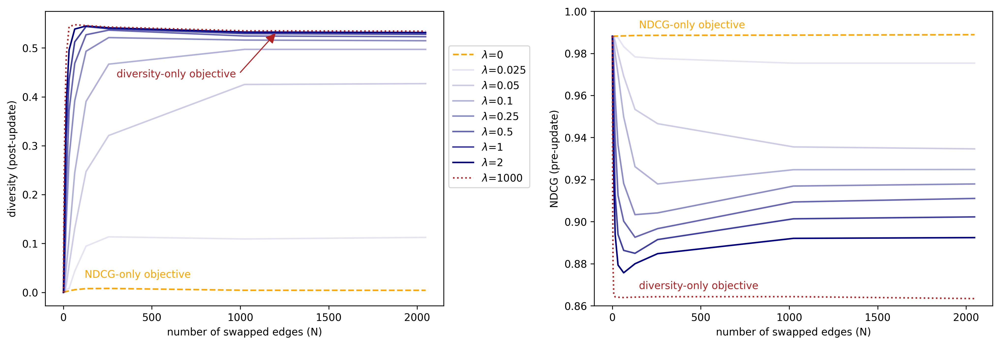
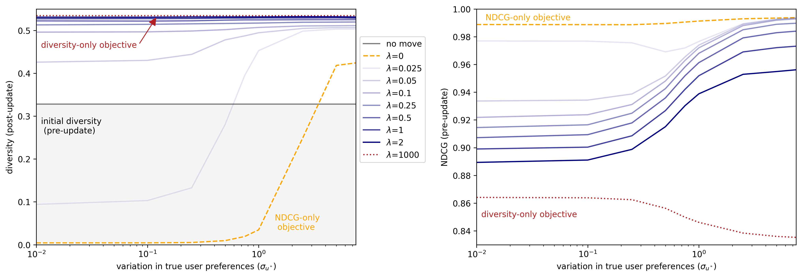
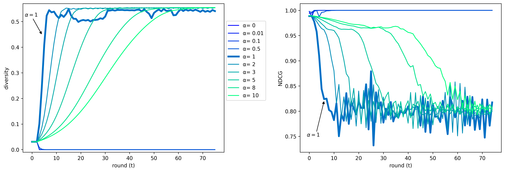
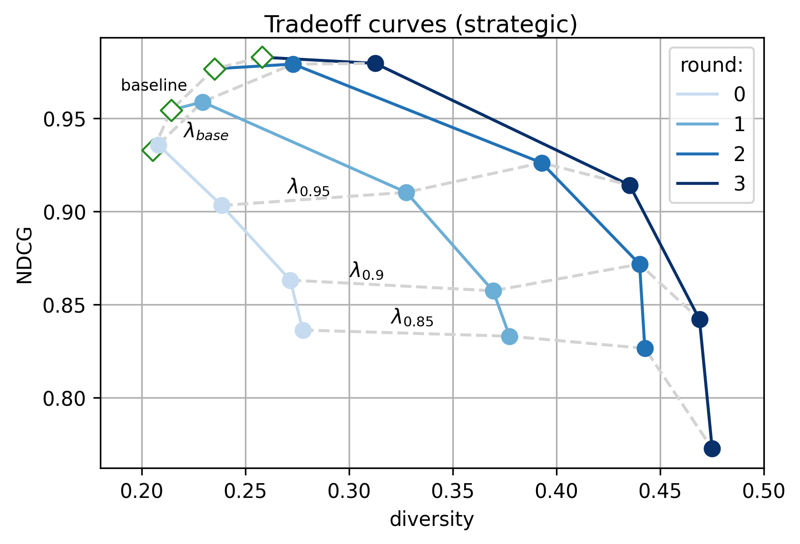

# Performative Recommendation: Diversifying Content via Strategic Incentives: paper code
This is the code for the paper Performative Recommendation: Diversifying Content via Strategic Incentives.

Installation instructions:

Create new environment and use the requirements.txt file to install all packages. You can use the following line:
```
  conda env create -f environment.yml
  
  conda activate performative_rec
```
The code consists from two main parts: synthetic experiments and real data experiment.
All the experiments must executed from the same folder that the experiment script is located.
## Synthetic experiments
There are three main synthetic experiments:
### The role of variation in user item lists (section 5.1)
In order to run this experiment you have to run the file "user_overlap_exp.py" i.e the following line:
```
    python synthetic_exp/user_overlap_exp.py
``` 

The arguments for this experiment are:
```
    --list: The length of each user's list of recommendations (i.e the number of items that each user is connected to).
    -nu: Number of users in the system.
    -ni: Number of items in the system.
    --lambda: The diversity regularization parameter.
    --ustd: The std of each feature in the ground truth user preferences vector (u*).
    --xstd: The std of each feature in the items featrure vector.
    -ne: Number of epoch to train the model.
    --tau_sig: The sigmoid function temperature as described in section 3.1.
    --tau_div: The soft permutation matrix temperature for diversity calculation.
    --tau_ndcg: The soft permutation matrix temperature for NDCG calculation.
    --lr: The optimization learning rate. 
    --dim: The dimension of the experiment (number of feature of each item).
    --iter: The number of iteration to repeat this experiment.
    --num_swap: The number of edges that are swaped between diffrent users.
```


### The role of variation in true user preferences (section 5.2)
In order to run this experiment you have to run the file "user_overlap_exp.py" i.e the following line:
```
    python synthetic_exp/user_dispersal_exp.py
``` 

The arguments for this experiment are:
```
    -a: Alpha is the scaling parameter that determines the intensity of stratgeic updates (equation 6).
    --list: The length of each user's list of recommendations (i.e the number of items that each user is connected to).
    -nu: Number of users in the system.
    -ni: Number of items in the system.
    --lambda: The diversity regularization parameter.
    --ustd: The std of each feature in the ground truth user preferences vector (u*).
    --xstd: The std of each feature in the items featrure vector.
    -ne: Number of epoch to train the model.
    --tau_sig: The sigmoid function temperature as described in section 3.1.
    --tau_div: The soft permutation matrix temperature for diversity calculation.
    --tau_ndcg: The soft permutation matrix temperature for NDCG calculation.
    --lr: The optimization learning rate. 
    --dim: The dimension of the experiment (number of feature of each item).
    -k: The number of items to include in NDCG and diversity calculation.
    --iter: The number of iteration to repeat this experiment.
```


### The role of time vs. modification costs (section 5.3)
In order to run this experiment you have to run the file "multiple_rounds_exp.py" i.e the following line:
```
    python synthetic_exp/multiple_rounds_exp.py
``` 

The arguments for this experiment are:
```
    -a: Alpha is the scaling parameter that determines the intensity of stratgeic updates (equation 6).
    --list: The length of each user's list of recommendations (i.e the number of items that each user is connected to).
    -nu: Number of users in the system.
    -ni: Number of items in the system.
    --lambda: The diversity regularization parameter.
    --ustd: The std of each feature in the ground truth user preferences vector (u*).
    --xstd: The std of each feature in the items featrure vector.
    --time: The number of rounds to run the experiment.
    -ne: Number of epoch to train the model.
    --tau_sig: The sigmoid function temperature as described in section 3.1.
    --tau_div: The soft permutation matrix temperature for diversity calculation.
    --tau_ndcg: The soft permutation matrix temperature for NDCG calculation.
    --lr: The optimization learning rate. 
    --dim: The dimension of the experiment (number of feature of each item).
    -k: The number of items to include in NDCG and diversity calculation.
    --iter: The number of iteration to repeat this experiment.
    --random_graph: If this flag is set the items for these users are chosen uniformly.
    --num_swap: The number of edges that are swaped between diffrent users. 
                This is only relevant if random_graph is not set. 
```
For the experiment 'The role of time vs. modification costs' (section 5.3) we use num_swp 0 and didn't set random_graph.
Using this script you can also run the experiment 'Accuracy and diversity over time' (appendix C.3) and 'The role of the number of recommended items k' (appendix C.4). For those experiment use random_graph parameter.


## Real data experiment
The real experiment is based on parts of the data from <a href="https://www.yelp.com/dataset/download">Yelp</a>.
However, this dataset is dynamic and is updated by yelp. 
In our code we rely on a specific set of attributes and keywords and therefore cannot support changes to the data structure and keywords that specify categories of restaurants.
In order to avoid cases where the code cannot be run due to incompatibility, we have stored in the folder real_data_exp_files/yelp_data the version of the data that the project supports. 
Since the data is very large and we rely on a very limited part of the data, we only stored the relevant information.
The files restaurant_features.csv and restaurant_features_for_pred.csv were originally created by running the script real_data_exp_files/data_creation/restaurant_data_creation.py
The script appears for reference but it cannot be run because the original input file is huge and was not uploaded to git. 
Similarly the file real_data_exp_files/data_creation/user_review_creation.py
Generates users_review_restaurant.json but cannot be run and is displayed for reference only. A zip file is provided instead:<br />
users_review_restaurant.zip <br />
In this zip there is the file users_review_restaurant.json. You must extract this file from the zip before running the experiments
After you unzipped users_review_restaurant.zip you have to run initialization.py that is located in real_data_exp_files
Now you can run real_data_exp.py that in real_data_exp_files.
 
This experiment has two stages: 
1. **Simulate the dynamic process over the rounds:** <br />
 This stage includes training the models and simulating items responses. <br />
Given a target NDCG in each round we look for model that achieves NDCG that close to target NDCG. The model is saved in: <br />
'real_data_exp_files/models_yelp/k_{k}_{alpha}_{ndcg_target}_{model_kind}' <br /> 
where model_kind is strategic_model or non_strategic depends on regularization kind (see flag 'strategic_model'). 
At the end of each round we simulate the strategic response of items to the trained model. The post strategic items are saved similarly to the models in: <br />
'real_data_exp_files/yelp_data/strategic_data'.
2. **Test stage:** <br />
After running the first stage with few NDCG target we create file with the result. <br />
This experiment gets list of NDCG target and for each NDCG target load the models and the strategic responses from the previous stage and calculate strategic response. <br />
at the end of the execution of the program you can find in folder result you can find sub folder: <br />
k_{k}_alpha_{modle_kind} <br />
where model_kind is strategic_model or non_strategic depends on regularization kind (see flag 'strategic_model'). <br />
Inside this sub folder there is a json files with the results of this experiment. <br />
Note that those files are numbered from start_time to 2*end_time. The results in the even times are those in the paper since they follow the definition in the paper for round. (section  2.2). <br />
The odd result are interim results i.e items are change according to model from previous round and model is tested on those changes without retraining.

The arguments for this experiment are:
```
    --ndcg_target: The NDCG that we aim to achive. We look for model that achive NDCG around this value. Only relevant 
                   in training. If the value is 2.0 the model traines without regularization. 
    --ndcg_target_list: A list of NDCG that we are looking at the models we aimed to achieve (relevant only in the test).
    -ne: Number of epoch to train the model.
    --strategic_model: If this flag is set the model is trained with strategic lookahead regularization (i.e eq 10). 
                       Without this flage the model that is used is the one that maximize divesity in current round (eq 7).
    --test: Test mode that test all the models in a given rounds (see start_time and end_time parameters) and tried to 
            achive NDCG in ndcg_target_list. 
    --calc_post_items: Calculations strategic response of items to the recommendation system (assuming that the model are already trained). 
    --batch_size: The batch size for training.
    --ndcg_div_lr: The optimization learning rate.
    -k: The number of items to include in NDCG and diversity calculation.
    --tau_sig: The sigmoid function temperature as described in section 3.1.
    --tau_div: The soft permutation matrix temperature for diversity calculation.
    --tau_ndcg: The soft permutation matrix temperature for NDCG calculation.
    -a: Alpha is the scaling parameter that determines the intensity of stratgeic updates (equation 6).
    --start_time: Training begins at this time. When start_time is 0, use the original data, 
                  otherwise use start_time -1 (if it exists).
    --end_time: Training ends at this time.
     
```

